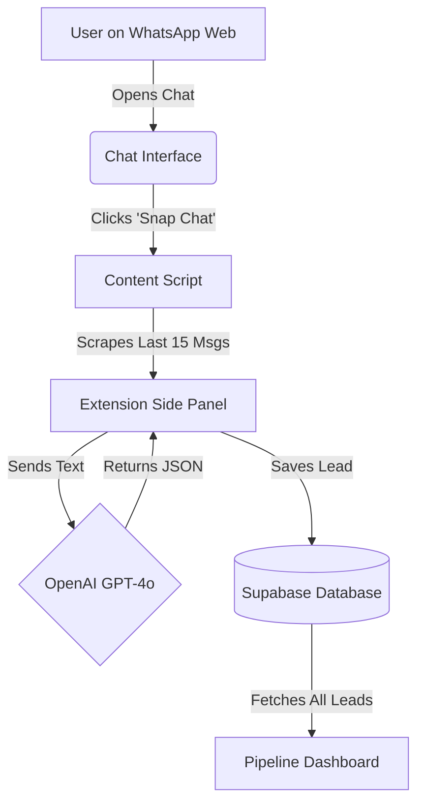

# WhatsApp Micro-CRM (MVP)

**Turn your WhatsApp Chat History into a Revenue Pipeline.**  
An *Indie Hacker* browser extension that connects **WhatsApp Web** to **OpenAI** & **Supabase**.

---

## How It Works (Architecture)



## Features

- **One-Click Snap**: Instantly scrape contact name and chat history from any WhatsApp conversation.
- **AI-Powered Analysis**: Uses OpenAI (GPT-4o Mini) to automatically:
  - Score leads (Hot, Warm, Cold).
  - Summarize conversations.
  - Suggest next actions.
  - Extract potential deal values.
- **Pipeline Dashboard**: Built-in dashboard to view and manage all your snapped leads.
- **Premium UI**: Dark mode, glassmorphism design, and dynamic status badges.
- **Supabase Integration**: Secure cloud storage for all your lead data.

## Tech Stack

- **Framework**: [Plasmo](https://docs.plasmo.com/) (React for Chrome Extensions)
- **Styling**: Tailwind CSS
- **AI**: OpenAI API (GPT-4o Mini)
- **Backend**: Supabase (PostgreSQL)
- **Language**: TypeScript

## Getting Started

### Prerequisites

- Node.js (v18 or higher recommended)
- A Supabase account
- An OpenAI API key

### Installation

1. **Clone the repository**
   ```bash
   git clone https://github.com/binaryninja437/whatsapp-micro-crm.git
   cd whatsapp-micro-crm
   ```

2. **Install dependencies**
   ```bash
   npm install
   ```

3. **Set up Environment Variables**
   Create a `.env.local` file in the root directory and add your OpenAI Key:
   ```env
   PLASMO_PUBLIC_OPENAI_KEY=sk-proj-your-openai-key-here
   ```

   > **Note**: For Supabase, check `src/lib/supabase.ts` and update the URL and Anon Key. For production, move these to `.env.local` as well.

4. **Set up Supabase Database**
   Run the following SQL in your Supabase SQL Editor to create the required table:

   ```sql
   create table leads (
     id bigint generated by default as identity primary key,
     created_at timestamp with time zone default timezone('utc'::text, now()) not null,
     contact_name text,
     summary jsonb,
     messages text[]
   );
   ```

5. **Run the Development Server**
   ```bash
   npm run dev
   ```

6. **Load into Chrome**
   - Open Chrome and go to `chrome://extensions`.
   - Enable **Developer mode** (top right).
   - Click **Load unpacked**.
   - Select the `build/chrome-mv3-dev` folder generated by the previous step.

## Usage

1. Open [WhatsApp Web](https://web.whatsapp.com/).
2. Open the extension side panel.
3. Open a chat with a potential lead.
4. Click **"Snap This Lead"**.
5. Watch as AI analyzes the chat and saves it to your pipeline.
6. Click the **"Pipeline"** tab to view your leads.

## License

This project is open source and available under the [MIT License](LICENSE).
